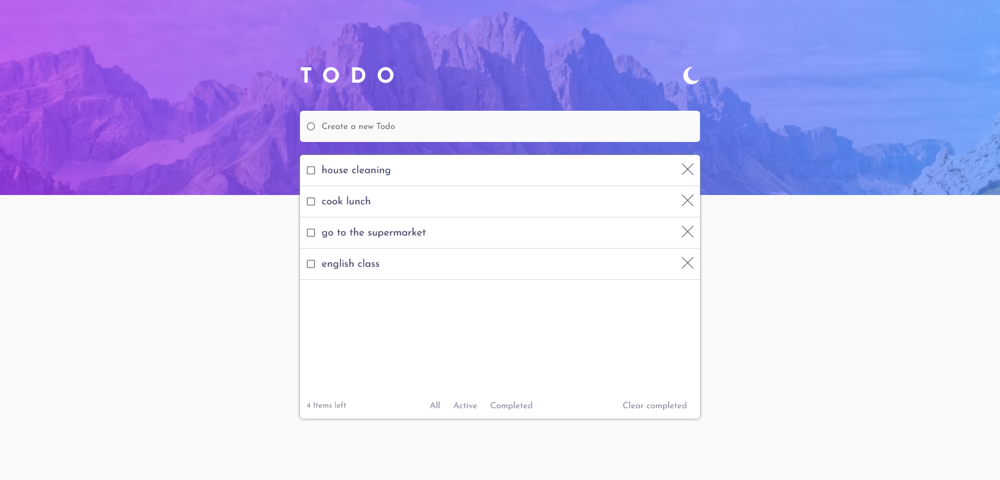

# Todo app solution - Frontend Mentor 

### Live link
> https://todo-app-five-lime.vercel.app/

## Visão geral
O meu objetivo com o projeto era entender e fixar melhor os conceitos básicos do React, implementar um dark mode e trabalhar com o localStorage para salvar os dados de navegação do usuário.

### O desafio
O desafio consistia em fazer uma aplicação web responsiva de uma lista de tarefas, podendo adicionar, marcar como completa e deletar as tarefas, além de poder filtrar entre as categorias de forma a exibir todas as tarefas, apenas as ativas ou apenas as completas. Também com a função de alternar o tema para dark mode e salvar os dados de navegação no localStorage.

### Captura de tela

## Como instalar e acessar localmente

- É preciso ter o Node.JS instalado. Ou acesse o link para download:
> https://nodejs.org/en/download

- Recomendo também o uso do Git:
> https://git-scm.com/downloads

- Crie uma pasta com um nome qualquer onde preferir. Ex: 'Projetos' na área de trabalho.

- Dentro da pasta clique com o botão direito do mouse e escolha a opção:
> 'Git Bash Here'

- Com o terminal aberto faça um clone do projeto digitando:
> git clone https://github.com/willianmassayuki/Todo-app.git

- Ou faça o downloado o arquivo zip e o descompacte na pasta 'Projetos'

- Dentro da pasta do projeto onde se encontram as pastas 'src', 'public', 'node_modules' 
abra o terminal do git novamente com o botão direito do mouse vá em 'Git Bash Here' e digite o comando:
> npm install vite 

- Para rodar o projeto digite o comando:
> npm run dev

- Aperte Ctrl e clique no endereço local

## Para testar
- Passe o mouse sobre os elementos da tela para verificar os efeitos de interação;
- Redimensione o tamanho da janela do navegador para conferir a responsividade;
- Clique no ìcone de lua ou sol para mudar de tema;
- Digite uma tarefa e clique não botão ao lado para adicionar;
- Clique na checkbox para marcar a tarefa como concluída;
- Clique no "X" para excluir uma tarefa;
- Clique em "Clear completed" para excluir todas as tarefas já concluídas;
- Clique nas categorias na parte inferior central para filtrar tarefas completas ou não;
- Recarregue ou feche a abra novamente a página para conferir se os dados continuam salvos;

### Construído com
Vite
React.JS (Hooks useState e useEffect, Template literals, operador ternário )
SASS (Mixins, variáveis, nesting, importação de aquivos)

